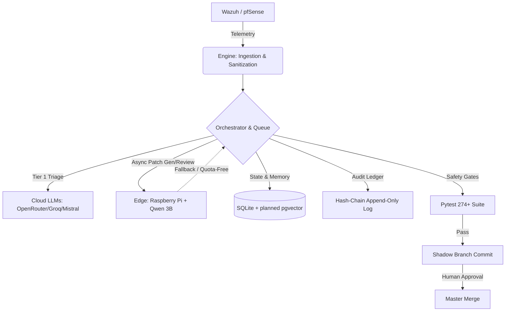

# soc-autopilot

[](https://www.python.org/)
[-orange.svg)](https://github.com/Steve-Wiig/soc-autopilot)
[](LICENSE)
[](docs/ARCHITECTURE.md)

**A locally operated Security Operations Center with LLM-assisted triage and a governed, self-improving codebase.**

---

### 🏗️ High-Level Architecture



---

### 🎯 Problem & Solution

**Problem:** Enterprise SOAR/XDR tools are expensive, cloud-bound, and often lack transparent, auditable automation. LLMs, when wired directly to systems, are untrusted and prone to hallucination.

**Solution:** `soc-autopilot` is a local-first, self-hosted platform (with cloud-assisted generation) that uses Small Language Models (SLMs) for Tier 1 triage and enrichment, governed by a strict, test-gated autonomous engineering pipeline.

**Core Philosophy:** *LLMs propose → safety gates validate → tests verify → Git records → humans decide.*

---

### 🛡️ Security & Governance Model

This is not an "autonomous AI" that acts without oversight. It is a **bounded decision-support system** built on security engineering principles:

**Development Phase (Current - Autonomous Code Improvement):**
- **Zero Trust for LLM Output:** All generated code must pass AST validation, ghost-name checks, and a 274+ test pytest suite before being considered.
- **Autonomous Merge:** Validated patches are automatically merged to master after passing the 10-stage safety pipeline and canary validation.
- **Negative Memory:** The system stores proven and failed fix patterns to inform future generation.
- **Tamper-Evident Auditing:** Pipeline decisions are tracked in structured JSONL ledgers. A tamper-evident hash-chain audit ledger is prototyped but not yet in production use.
- **Hybrid Verification Plane:** A decoupled Raspberry Pi edge worker acts as an independent, heterogeneous code-review node, ensuring failure isolation and quota-free fallback.

**Production Phase (Planned - Human-Gated Security Operations):**
- **SOC Agent Proposals:** The system will propose security rules for Wazuh, pfSense, and Security Onion based on telemetry analysis.
- **Human Approval Mandatory:** All security configuration changes require explicit operator approval before application to production systems.
- **Automated Validation:** Proposed rules undergo syntax checks, policy validation, and impact analysis before presentation to operators.
- **Audit Trail:** All proposals, approvals, rejections, and applications are recorded with full provenance.


---

### 📊 Current Status & Evidence

| Component | Status | Notes |
|---|---|---|
| Telemetry Sanitization & Queue Governance | ✅ Implemented | Two-pass regex + entropy; backpressure handling. |
| Self-Improvement Pipeline (10 Safety Gates) | ✅ Implemented | TDD Red Phase, Forensic Analysis, Pre-flight checks. |
| Negative/Proven Memory Stores | ✅ Implemented | System actively stores and references fix patterns. |
| Hybrid Edge/Cloud Compute | ✅ Implemented | Async Pi worker (Qwen 3B) decoupled via queue. |
| Hash-Chain Audit Ledger | △ Prototype | Concurrency tool exists; production ledger planned. |
| Live Wazuh Integration | △ Lab-Validated | Tested in local Dockerized lab; production hardening pending. |
| Longitudinal Learning Metrics | △ Prototype | Tracking fix acceptance rates; immutable eval corpus planned. |
| PostgreSQL + pgvector | ❌ Not Implemented | Currently using SQLite. Architecture supports upgrade. |
| Suricata Integration | ❌ Not Implemented | Architecture supports it, but no logic exists yet. |

---

### 🚀 Quick Start

#### Prerequisites
* Python 3.10+
* API keys for LLM providers (OpenRouter, Groq, Mistral)
* Optional: Raspberry Pi 4B+ (8GB) for edge critique worker

#### Installation

```bash
git clone https://github.com/Steve-Wiig/soc-autopilot.git
cd soc-autopilot
pip install -r requirements.txt
cp .env.example .env
# Edit .env with your API keys
```

#### Verification

```bash
# Run the regression suite
python3 -m pytest tests/ -q
# Expected: 274 passed (2 transient test_tdd_auto_* failures are harmless)
```

#### Operator CLI

```bash
dashboard          # Live status, scorecard, disk health, and edge worker status
```

---

### 📚 Documentation

For deep dives into the architecture, operations, and self-improvement mechanics:

| Resource                                                   | Purpose                                              |
| ---------------------------------------------------------- | ---------------------------------------------------- |
| [`docs/ARCHITECTURE.md`](docs/ARCHITECTURE.md)             | System architecture, data flow, and design decisions |
| [`docs/OPERATIONS_RUNBOOK.md`](docs/OPERATIONS_RUNBOOK.md) | Operational workflows, troubleshooting, and runbooks |
| [`docs/OVERNIGHT_PIPELINE.md`](docs/OVERNIGHT_PIPELINE.md) | Self-improvement pipeline internals and safety gates |
| [`docs/WINTER_ROADMAP.md`](docs/WINTER_ROADMAP.md)         | Future development, including immutable eval corpus  |

---

### ⚠️ Limitations

* **Not a replacement for human analysts:** The system is designed to augment Tier 1 triage and propose *candidate* fixes. Human approval is mandatory for all **production security configuration** changes. Codebase improvements merge autonomously after passing the 10-stage safety pipeline.
* **Hardware constraints:** While the edge worker is resilient, high-volume local inference requires an NVIDIA GPU (16GB+ VRAM). The current default relies on free-tier cloud APIs + a Raspberry Pi for async review.

---

## License

**MIT License**
Copyright (c) 2026 Steve Wiig
