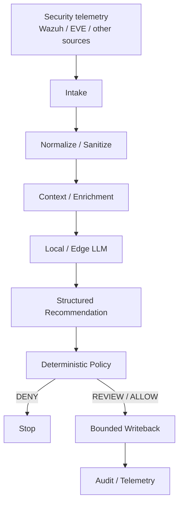
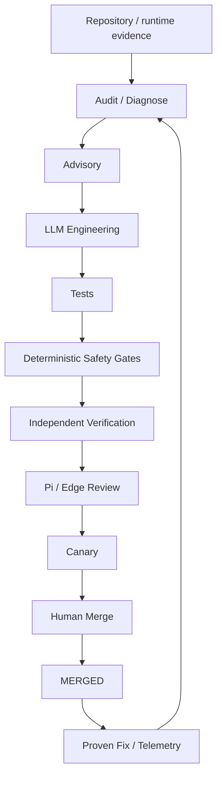

# SOC-Autopilot

Local-first, evidence-driven security orchestration and autonomous software maintenance.

> **LLMs propose → safety gates validate → tests verify → independent verification audits → Git records → humans decide where required.**

## Current state

SOC-Autopilot is an experimental/research project currently focused on hardening and consolidation rather than feature expansion.

The autonomous development workflow is not the same thing as autonomous production SOC authorization. Validation and promotion controls remain part of the safety boundary.

## Validation

The engineering workflow favors:

`invariant -> regression test -> smallest safe change -> targeted verification -> full regression suite -> promotion / human review where required`


## Architecture Overview

Architecture visual available in docs/assets/architecture.mmd

## What this project is

SOC-Autopilot explores two separate autonomy domains that share verification discipline but have different authorities:

### 1. SOC operational autonomy



The model is the reasoning and proposal layer. It is **not** the final authority for consequential actions.

### 2. Development autonomy



Development autonomy can continuously improve the codebase, but it does **not** directly authorize SOC actions.

## Security model

The core security rule is:

> **External content may be evidence without becoming authority.**

Alerts, enrichment data, retrieved text, historical documents, model responses, and tool output are treated as data unless independently authorized by trusted policy.

The project explicitly aims to enforce:

- Untrusted data cannot elevate its own trust level.
- Model output cannot authorize itself.
- Historical text cannot override current policy.
- LLM consensus is not by itself deterministic authorization.
- Consequential writeback requires a bounded action contract.
- Material decisions and execution attempts must remain auditable.

See [`docs/SECURITY_MODEL.md`](docs/SECURITY_MODEL.md).

## Local-first LLM policy

Cloud LLMs may be used for development work such as code generation, code review, adversarial review, testing, documentation, and architecture work.

Production SOC inference is intended to remain operator-controlled local/edge inference. The architecture is designed so deterministic policy remains between model-generated recommendations and consequential operational actions.

## Current-state terminology

Repository documentation uses these terms deliberately:

| Status | Meaning |
|---|---|
| **OBSERVED** | Supported by current repository/runtime evidence |
| **EXPERIMENTAL** | Implemented or partially implemented, but isolated or not proven as the canonical path |
| **PLANNED** | Intended design not yet fully implemented |
| **UNKNOWN** | Requires additional repository or runtime evidence |

This project intentionally avoids presenting planned architecture as already implemented.

## Current architecture and runtime evidence

Start here:

- [`docs/ARCHITECTURE.md`](docs/ARCHITECTURE.md) — architecture and current hardening notes
- [`docs/CURRENT_RUNTIME_MAP.md`](docs/CURRENT_RUNTIME_MAP.md) — implementation-backed runtime map
- [`docs/SECURITY_MODEL.md`](docs/SECURITY_MODEL.md) — trust boundaries and security invariants
- [`docs/DEVELOPMENT_AUTONOMY.md`](docs/DEVELOPMENT_AUTONOMY.md) — autonomous development model
- [`docs/DEVELOPMENT_WORKER_CONTRACT.md`](docs/DEVELOPMENT_WORKER_CONTRACT.md) — worker contracts
- [`docs/OPERATIONS_RUNBOOK.md`](docs/OPERATIONS_RUNBOOK.md) — operational procedures

Historical/generated documents are not treated as architectural authority unless explicitly identified as current evidence.

## Safety and engineering philosophy

The project favors:

- local-first processing for sensitive operational workloads
- deterministic gates around consequential actions
- explicit trust boundaries
- bounded autonomous mutation
- regression and adversarial testing
- rollback and observable failure handling
- human authority over promotion where required
- evidence-backed telemetry rather than optimistic success accounting

Generated changes must be treated as untrusted until they pass the applicable validation and promotion controls.

## Current hardening focus

The current engineering phase emphasizes **hardening and consolidation rather than feature expansion**.

Examples include:

- production routing isolation
- autonomous patch path containment and file authorization
- fail-closed ambiguous patch matching
- promotion-state integrity
- truthful Pi review telemetry
- candidate and worker identity binding
- replay protection
- deterministic verification of autonomous changes

## Project status

SOC-Autopilot is an experimental/research project.

It is **not** presented as a finished autonomous production SOC operator. The repository distinguishes implementation evidence from planned architecture and continues to harden the safety and verification boundaries.

## Repository

```text
engine/        Core contracts, routing, patching, verification
overnight/     Development-autonomy and improvement workflow
edge/          Edge/Pi review components
orchestrator/  Workflow/orchestration components
contracts/     Structured interfaces and schemas
tests/         Regression and adversarial tests
tools/         Verification, telemetry, and operational tooling
docs/          Canonical architecture, security, and runtime documentation
```

## Contributing

Changes to trust boundaries, promotion logic, routing isolation, patch mutation, telemetry semantics, or worker verification should receive stronger review and regression coverage than ordinary maintenance.

When making autonomous-development changes, prefer:

```text
one invariant
    ↓
one regression test
    ↓
smallest safe implementation change
    ↓
targeted verification
    ↓
full regression suite
    ↓
human review / promotion
```

## License

See the repository for the current licensing information.
